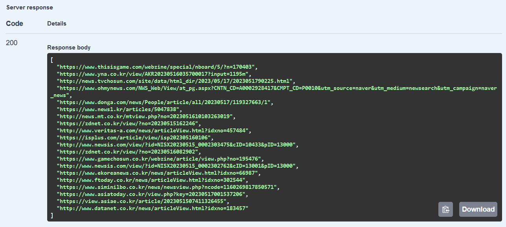
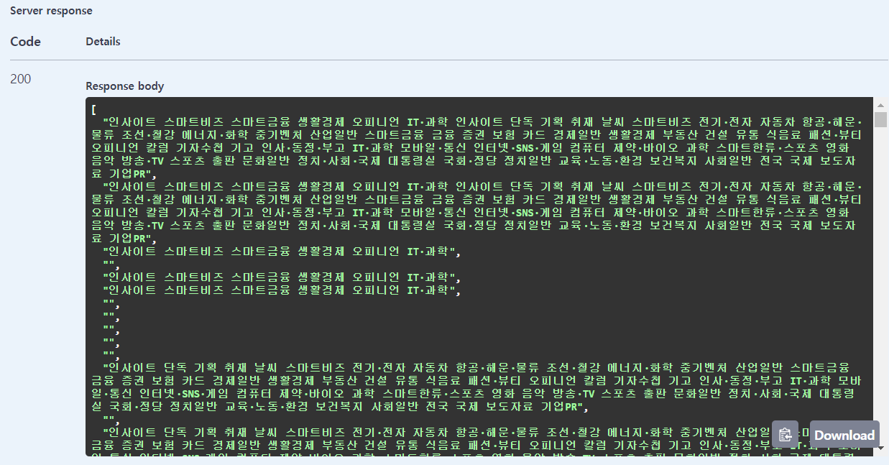
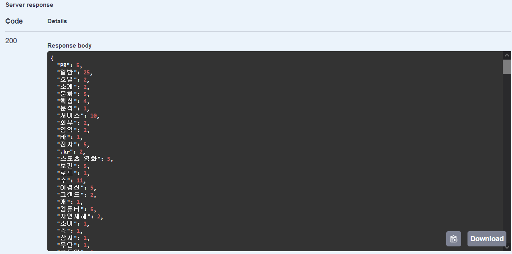

# SpringBoot로 크롤링 및 형태소 분석 API 구축하기
SpringBoot을 REST API로 사용하여 네이버뉴스에 검색후 조회되는 뉴스 별 검색내역을 형태소 분석 후 집계하는 프로그렘이다. 
※ 기능 구현까지는 완료했으나 방대한 데이터를 처리하는 과정에서 시간이 많이 소요되는 문제가 있어 개선중이다.

### 1. Spring Boot로 프로젝트 생성하기  
- Spring Boot 사이트(https://start.spring.io/) 접속 후 프로젝트 생성 (이때 Dependency는 Spring Web 추가할 것)
- 생성된 프로젝트를 개인 IDE에서 실행 (java 경로에 생성된 프로젝트명.java 파일에서 Run(F5)으로 실행)
- Controller 추가 후 프로젝트 실행하기 (초기 Port : 8080) 테스트는 localhost:8080/hello 로 호출하면 json 데이터를 Return 받을 수 있다. 
  

### 2. build.gradle에 의존성 추가
```gradle
repositories {
	///기존 소스
    maven { url 'https://jitpack.io' }
}
dependencies {
    ///기존 소스
    //jsoup
    implementation 'org.jsoup:jsoup:1.14.2'

    //KOMORAN
    implementation 'com.github.shin285:KOMORAN:3.3.9'

    //Swagger
    implementation 'org.springdoc:springdoc-openapi-starter-webmvc-ui:2.0.2'
}
```  
- jsoup은 HTML 문서에 저장된 데이터를 구문 분석, 추출 및 조작하도록 설계된 오픈소스 Java 라이브러리이다.
- KOMORAN은 Java로 개발된 한국어 형태소 분석기이다.  
- Swagger는 개발자가 REST 웹 서비스를 설계, 빌드, 문서화, 소비하는 일을 도와주는 오픈 소스 프레임워크이다.

### 3. 네이버 뉴스에서 검색어로 조회 시 나오는 뉴스 URL 추출하기  
뉴스에 검색어를 입력하고 조회하면 각 페이지마다 아래와 같은 URL의 규칙을 볼 수 있다. (각 페이지별로 Start 검색조건만 다름)
```
검색어 : 개발자
1 페이지: https://search.naver.com/search.naver?where=news&sm=tab_pge&query=%EA%B0%9C%EB%B0%9C%EC%9E%90&sort=0&photo=0&field=0&pd=0&ds=&de=&cluster_rank=41&mynews=0&office_type=0&office_section_code=0&news_office_checked=&nso=so:r,p:all,a:all&start=1 

2 페이지 : https://search.naver.com/search.naver?where=news&sm=tab_pge&query=%EA%B0%9C%EB%B0%9C%EC%9E%90&sort=0&photo=0&field=0&pd=0&ds=&de=&cluster_rank=25&mynews=0&office_type=0&office_section_code=0&news_office_checked=&nso=so:r,p:all,a:all&start=11
```  
이제 이 URL을 이용해서 조회된 화면에 URL을 추출해보자. 먼저 URL을 배열로 추가한다.
```java
//조회할 URL 
    //네이버 뉴스 검색어:개발자, 옵션: 관련도순
    public String[] url = { 
        "https://search.naver.com/search.naver?where=news&sm=tab_pge&query=%EA%B0%9C%EB%B0%9C%EC%9E%90&sort=0&photo=0&field=0&pd=0&ds=&de=&cluster_rank=41&mynews=0&office_type=0&office_section_code=0&news_office_checked=&nso=so:r,p:all,a:all&start=1"
       ,"https://search.naver.com/search.naver?where=news&sm=tab_pge&query=%EA%B0%9C%EB%B0%9C%EC%9E%90&sort=0&photo=0&field=0&pd=0&ds=&de=&cluster_rank=66&mynews=0&office_type=0&office_section_code=0&news_office_checked=&nso=so:r,p:all,a:all&start=11"
    };
```  
다음으로 네이버 뉴스 URL 링크를 가져오는 소스를 구현한다. 네이버 뉴스의 경우 URL링크의 class를 `.news_tit` 사용하기에 이 속성을 활용하면 쉽게 데이터를 추출할 수 있다.
```java
//페이지에서 URL 추출하기      
    @GetMapping("api/crawling/UrlList")         
    public List<String> UrlList() {     
        List<String> mergedList = new ArrayList<>();
        for (String el : url) {                       
            try {
                Connection conn = Jsoup.connect(el);
                Document document = null;            
                document = conn.get();

                List<String> list = getDataUrlList(document);
                mergedList.addAll(list);
                
            } catch (IOException e) {
                e.printStackTrace();
            }                
        }               
        return mergedList;
    }

    public List<String> getDataUrlList(Document document) {
        List<String> list = new ArrayList<>();

        //태그중 class가 .news_tit인 태그만 추출
        Elements selects = document.select(".news_tit");

        //해당 테그에서 href 속성값을 추출
        for (Element select : selects) {
            list.add((select.attr("href")).toString());
        }
        return list;
    }
```
Swagger(http://localhost:8080/swagger-ui/index.html)에서 확인해보면 아래와 같이 URL을 추출한 것을 확인할 수 있다.  
  

### 4. 각 URL 별로 텍스트 데이터 추출하기
뉴스의 텍스트들은 대부분 div나 p 태그 안에 있기에 해당 특징을 기반으로 텍스트를 추출한다.
```java
//페이지 텍스트 추출하기        
    @GetMapping("api/crawling/UrlText")   
    public List<String> UrlText() {
        List<String> urlList = UrlList();
        
        List<String> mergedList = new ArrayList<>();
    
        for (String el : urlList) {            
            try {
                Connection conn = Jsoup.connect(el);
                Document document = null;
                document = conn.get();

                List<String> list = getDataList(document);

                mergedList.addAll(list);
            } catch (IOException e) {
                e.printStackTrace();
            }                                                
        }

        return mergedList;
    }

    public List<String> getDataList(Document document) {
        List<String> list = new ArrayList<>();
        //div or p 태그만 선택
        List<Element> selects = document.select("div,p");

        //각 태그에 텍스트 추출
        for (Element select : selects) {
            list.add((select.text()).toString());
        }
        return list;
    }
```
확인해보면 아래와 같이 텍스트를 추출한 것을 확인할 수 있다.  
  

### 5. 텍스트 형태소 분석하기
이제 추출한 텍스트의 형태소를 분석하여 각 단어별 빈도를 확인하는 소스를 작성할 것이다.
```java
//텍스트 형태소 분석        
    public List<String> getVocaList(String text){        
        Komoran komoran = new Komoran(DEFAULT_MODEL.FULL);        

        KomoranResult anayResultList = komoran.analyze(text);

        //일반명사(NNG), 대명사(NNP), 의존명사(NNB), 외국어(SL)만 추출
        List<String> list = anayResultList.getMorphesByTags("NNG", "NNP", "NNB", "SL");

        return list;
    }

    //웹 크롤링 및 형태소 분석
    @GetMapping("api/crawling/getCrawlingList") 
    public HashMap<String, Integer> getCrawlingList(){
        List<String> textList = UrlText();                
        HashMap<String, Integer> map = new HashMap<String, Integer>();
        Integer count = 0;
        
        for(String text : textList){
            List<String> list = getVocaList(text);  
            
            for(String val : list){         
                count++;       
                if(map.get(val) != null){
                    map.put(val,map.get(val)+1);
                }
                else{
                    map.put(val,1);
                }  
                
                if(count>1000){
                    return map;
                }
            }
        }

        return map;
    }
```
확인해보면 아래와 같이 단어 별 빈도를 확인할 수 있다. (다만 다량의 데이터를 처리하는데 시간이 오래 걸리기에 1000번 체크 후 강제 Return으로 테스트를 종료했음)
  


